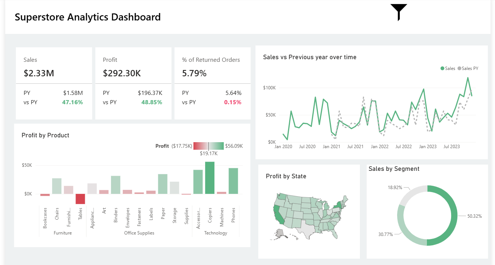

# 📊 Superstore Analytics Dashboard

This project analyzes sales and profitability trends for the **Superstore dataset** using **Power BI**.  
The dashboard answers key business questions and highlights important insights for decision-making.

---

## 📌 Business Questions

1. Metrics – Sales, Profit, % of Returned Orders. Show % change vs Previous Year (PY).  
2. Compare Sales performance versus Previous Year over time.  
3. Determine the most profitable product and the most loss-making product.  
4. Find out the location (state) where most of the profit is happening.  
5. Analyze Sales by Segment.  

---

## 📷 Dashboard Preview



---

## 📈 Key Features

- **KPI Cards**: Sales, Profit, % Returned Orders with YoY comparison.  
- **Time Series**: Sales vs PY performance trend.  
- **Product Analysis**: Profit by product to identify best & worst performers.  
- **Geographic Insights**: Profit by state on a map visualization.  
- **Customer Segmentation**: Sales share across different segments.  

---

## 🛠 Tools & Techniques

- **Power BI** for dashboard design and data visualization.  
- **DAX Measures** for KPIs and time intelligence calculations.  
- **Data Modeling** with fact (Orders, Returns) and dimension (Date, Products, Geography) tables.  
- **Data Cleaning & Transformation** using Power Query.  

---

## 📂 Repository Structure
```
Superstore-Sales-Analysis/
│
├── README.md # Project overview & key details
├── DAX_measures.md # All DAX measures with explanation
├── Workflow.md # Step-by-step execution process
├── Data_Dictionary.md # Dataset fields and descriptions
│
├── Superstore_Dashboard.pbix # Power BI project file
├── dashboard_preview.png # Screenshot of final dashboard
│
└── /data 
├── superstore_raw.csv

